-


## Introduction

The Employee Management System is a comprehensive and user-friendly application designed to streamline and simplify the process of managing employees within an organization. This system provides an efficient and organized way to handle various employee-related tasks, from onboarding and attendance tracking to performance evaluation and payroll management.


## Live Preview

To preview this project please visit https://hrms.shawon-khan.com/


## User Interface

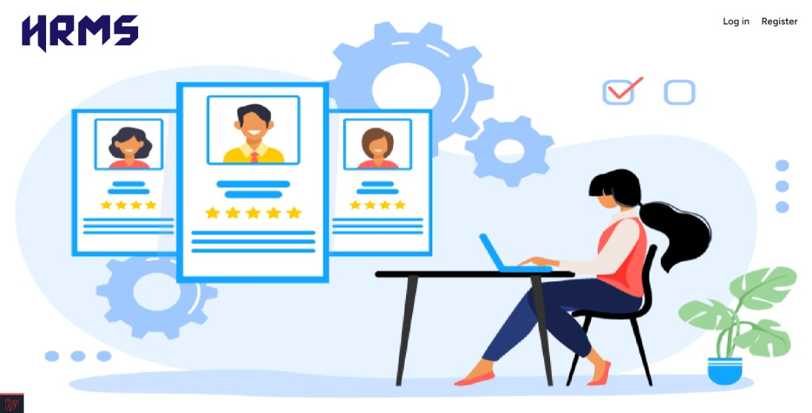

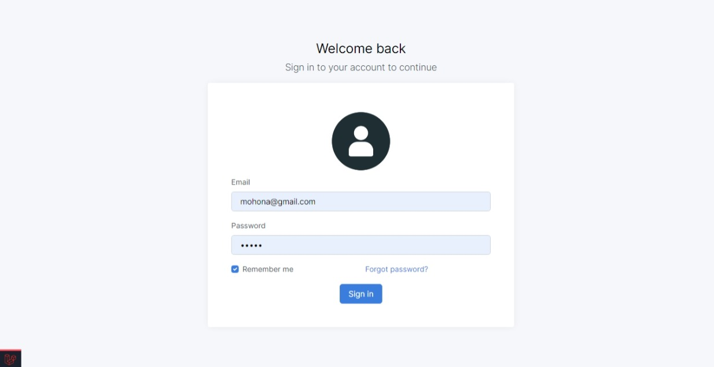

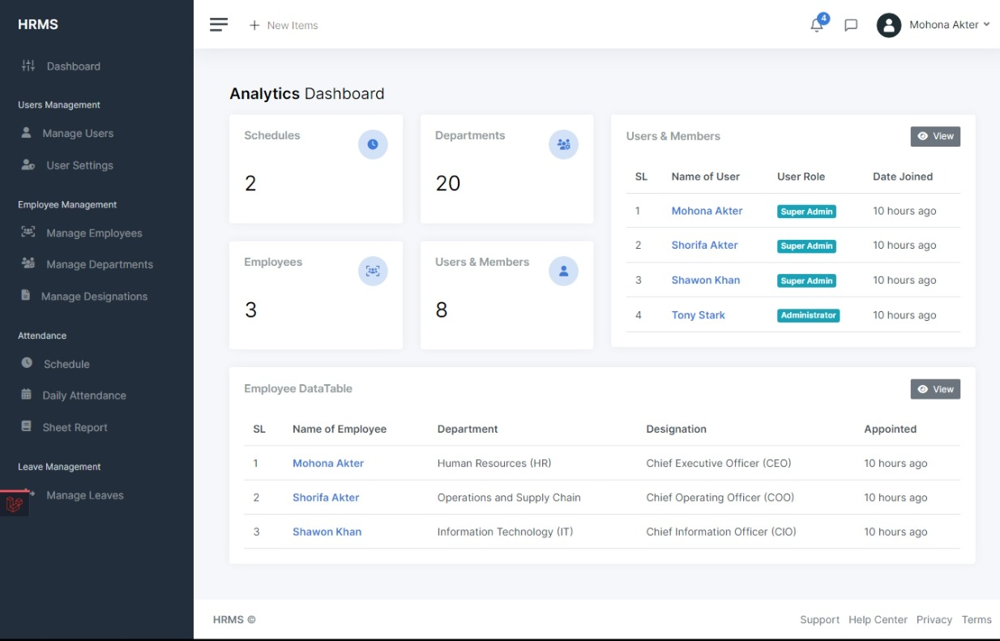

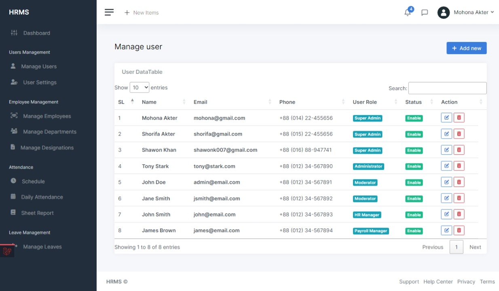

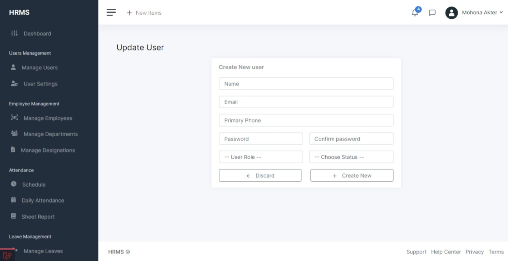

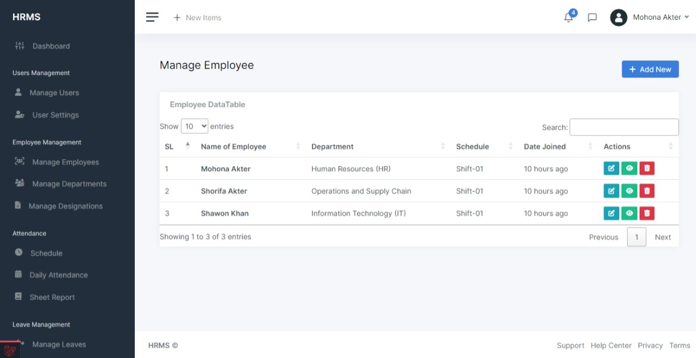

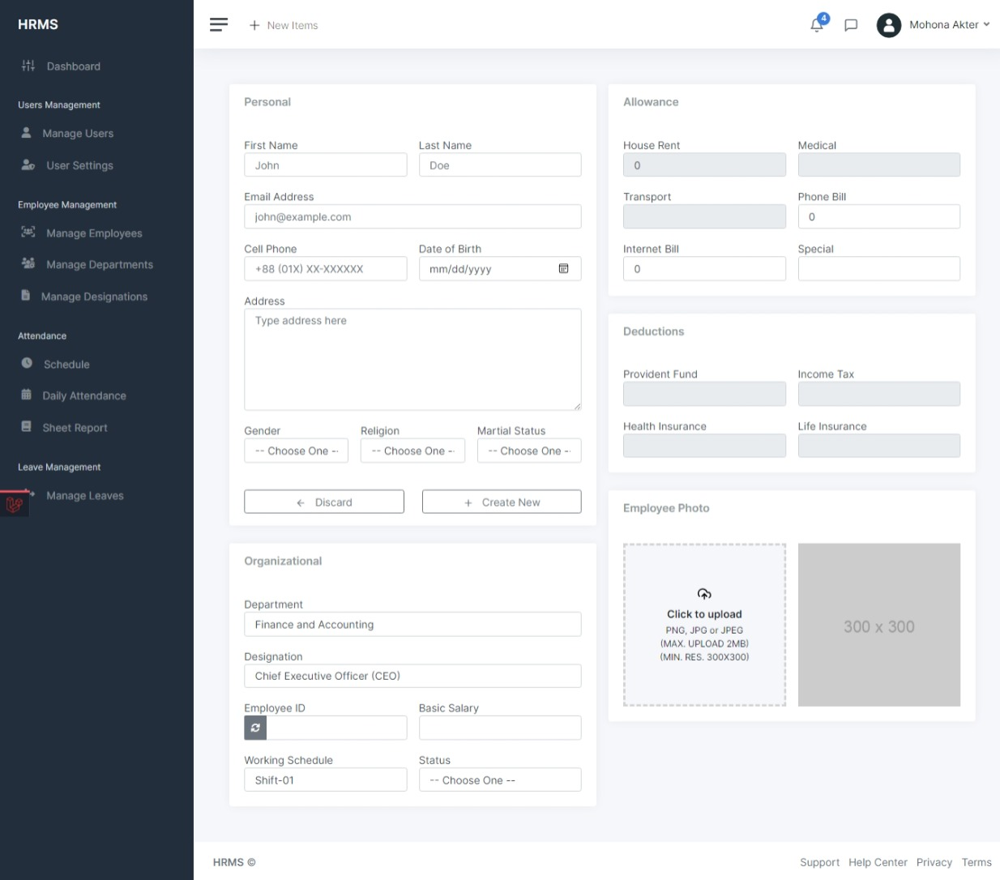

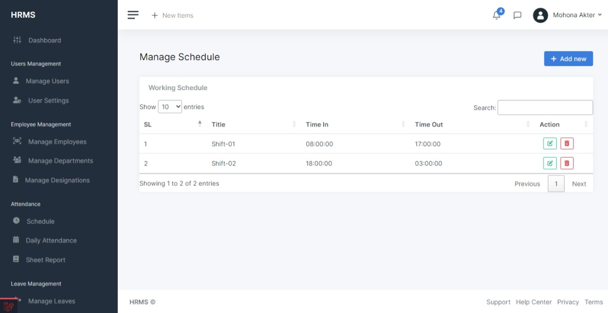

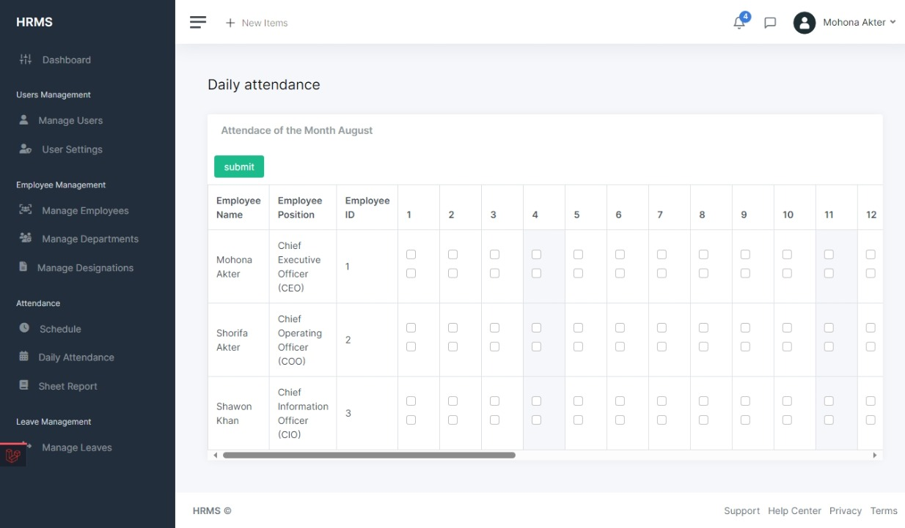

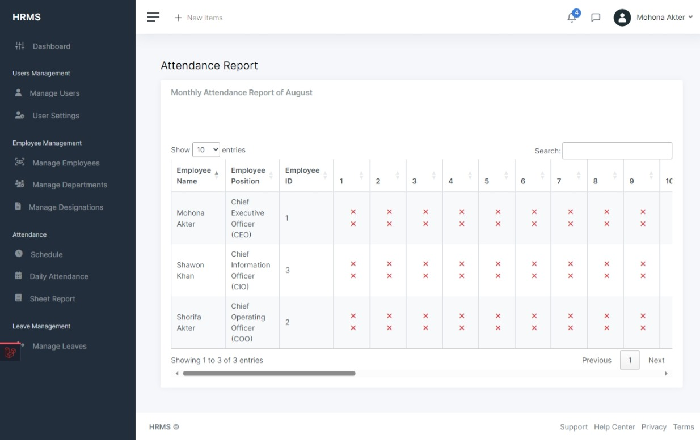

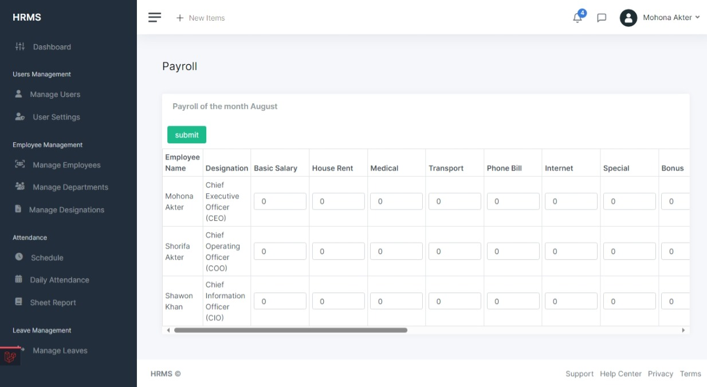


## Technologies Used

The following technologies have been used in the development of Employee Management System (HRMS):

- **[Laravel](https://laravel.com/)** : A popular PHP web application framework known for its elegant syntax and feature-rich ecosystem.
- **[Laravel Blade](https://laravel.com/)** : The templating engine provided by Laravel for designing and rendering views.
- **MySQL** : The database management system used to store application data.
- **[Bootstrap](https://getbootstrap.com/)** : A CSS framework for creating responsive and attractive UI components.
- **[FontAwesome](https://fontawesome.com/)**: A popular icon library that provides a wide range of icons for web projects.


## Usage

01. Log in to access the admin dashboard.
02. Add employees and provide necessary details.
03. Manage leave requests, assign tasks, and perform other administrative functions.
04. Employees can log in to view their profiles, submit leave requests, and update task statuses.


#### Prerequisites

Before you proceed, ensure you have the following software installed:

- PHP (Version 8.2)
- Composer (Version 2.5)
- MySQL (Version 8.2)
- Laravel (Version 10.16)


#### Installation

01. Clone the **Employee Management System** repository to your local machine using the following command:
```bash
git clone https://github.com/MOHONA678/employee-management-system.git
```

02. Navigate to the project directory:
```bash
cd employee-management-system
```

03. Install the required `PHP` dependencies using Composer:
```bash
composer install
```

04. Install `Node.js` dependencies
###### Using npm:
```bash
npm install
```
or,
###### using Yarn:
```bash
yarn
```

05. Generate `Vite` serve manifest:
###### Using npm:
```bash
npm run build
```
or,
###### using Yarn:
```bash
yarn build
```

06. Create a new MySQL database for Employee Management System and update the `.env` file with your database credentials:
```bash
cp .env.example .env
```

07. Generate a unique application key:
```bash
php artisan key:generate
```

08. Run the database migrations and seed the database with initial data:
```bash
php artisan migrate --seed
```

09. Start the development server:
```bash
php artisan serve
```

Congratulations! Employee Management System should now be up and running at `http://localhost:8000`.


